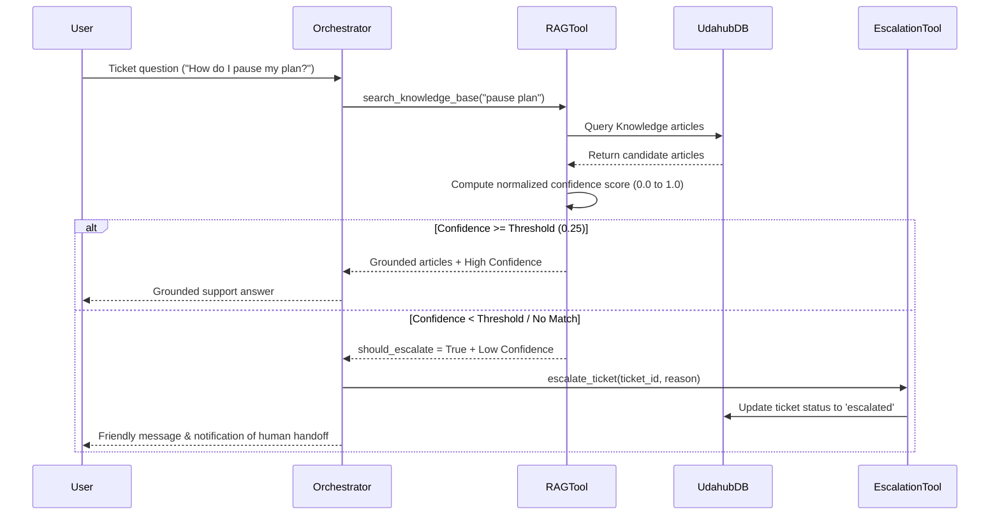

# RAG Knowledge Retrieval System & Escalation Architecture

## 1. Overview

The Knowledge Retrieval system performs Retrieval-Augmented Generation (RAG) over the 15 support articles stored in `udahub.db`. It ensures customer responses are grounded in official documentation and provides confidence-based escalation when no relevant article exists.

## 2. Sequence Diagram

## 3. Article Corpus Summary (15 Articles)

The knowledge base in `udahub.db` includes 15 distinct support articles:
1. *How to Reserve a Spot for an Event* (Tags: `reservation, events, booking, attendance`)
2. *What's Included in a CultPass Subscription* (Tags: `subscription, benefits, pricing, access`)
3. *How to Cancel or Pause a Subscription* (Tags: `cancelation, pause, subscription, billing`)
4. *How to Handle Login Issues?* (Tags: `login, password, access, escalation`)
5. *Refund and Compensation Policy* (Tags: `refund, policy, billing, compensation`)
6. *Premium Experience Upgrades and Quota Usage* (Tags: `premium, upgrade, quota, passes`)
7. *How to Transfer or Gift an Experience Pass* (Tags: `transfer, gift, sharing, pass`)
8. *App Crash and Technical Troubleshooting* (Tags: `app, crash, bug, technical, troubleshooting`)
9. *Family and Companion Access Guidelines* (Tags: `family, companion, guests, group`)
10. *Updating Payment Method and Billing Inquiries* (Tags: `payment, billing, credit card, update`)
11. *Venue Access, QR Codes, and Check-in Rules* (Tags: `venue, qr code, checkin, access, entry`)
12. *Pausing Subscription vs Cancellation Rules* (Tags: `pause, cancel, renewal, account`)
13. *Account Security, Unrecognized Charges, and Blocked Accounts* (Tags: `security, fraud, blocked, charges, account`)
14. *Submitting Feedback and Rating Experiences* (Tags: `feedback, rating, review, experience`)
15. *Special Accessibility and Venue Requirements* (Tags: `accessibility, venue, assistance, special needs`)

---

## 4. Confidence Scoring & Escalation Protocol

1. **Scoring Algorithm**:
   - Matches query terms against article `title` (weight 4.0), `tags` (weight 3.0), and `content` frequency (weight 1.0 + freq).
   - Normalizes score against maximum query potential to produce a float between `0.0` and `1.0`.

2. **Threshold & Decision**:
   - `min_confidence`: `0.25`.
   - If highest score $< 0.25$, `should_escalate` is set to `True`.
   - The agent invokes `escalate_ticket`, which sets ticket status to `"escalated"`, logs an audit trail in `udahub.db`, and returns a clear handoff response.
